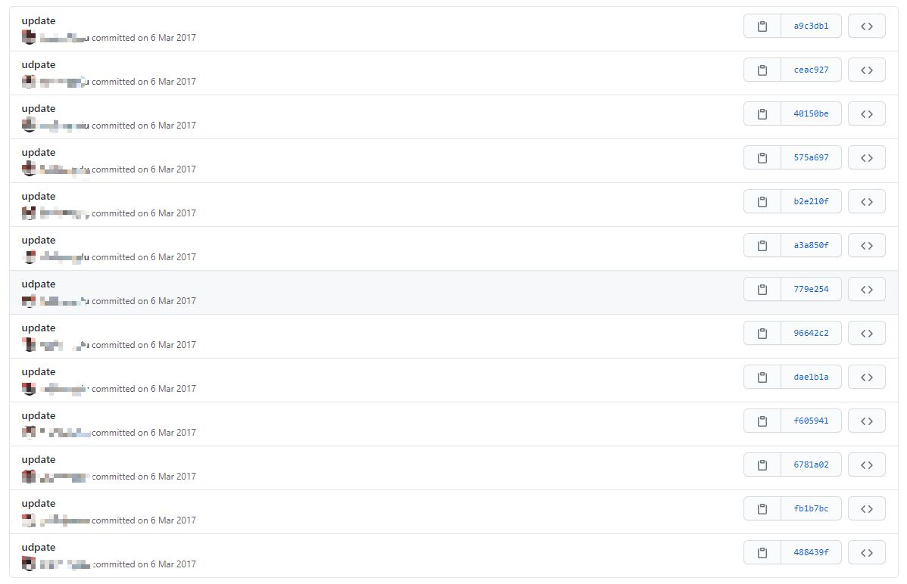
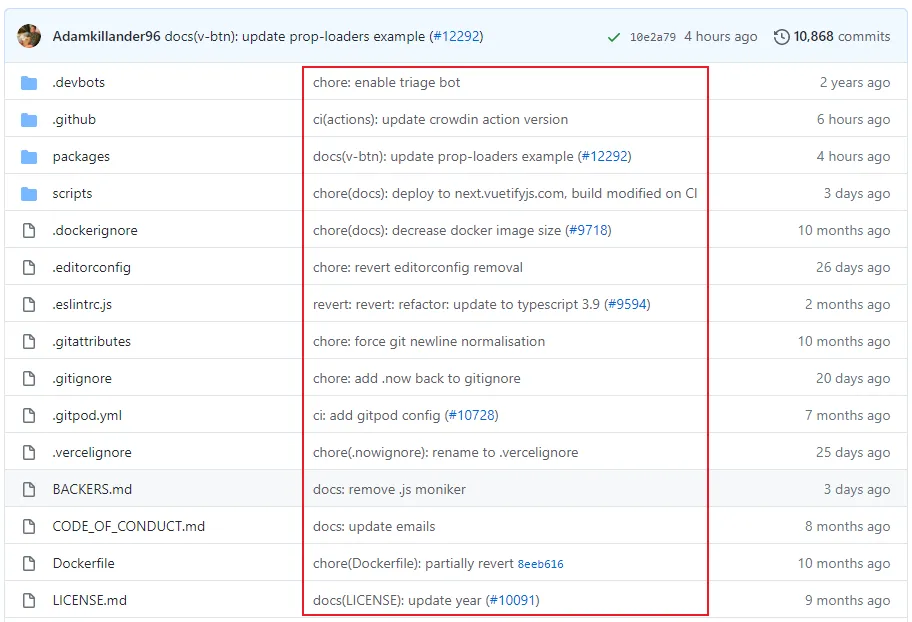

git 规定提交时必须要写提交信息，作为改动说明，保存在 commit 历史中，方便回溯。  
规范的 log 不仅有助于他人 review, 还可以有效的输出 CHANGELOG，甚至对于项目的研发质量都有很大的提升。  ，大多数同学对于 log 信息都是简单写写，没有很好的重视，甚至有些同学可能都不知道只会事儿...


### 为什么要规范commit message

一直在说要规范 commit message格式，那为什么要这样做呢？ 让我们先来看一个不太规范的 commit 记录：

看完以后什么感觉，这到底更新了什么啊，写得全是update，这种 commit 信息对于想要从中获取有效信息的人来说无疑是一种致命的打击。

那我们来看一个社区里面比较流行的Angular规范的 commit 记录:

看完是不是一目了然呢？

上图中这种规范的 commit 信息首先提供了更多的历史信息，方便快速浏览。其次，可以过滤某些 commit（比如文档改动），便于快速查找信息。

既然说到了 Angular 团队的规范是目前社区比较流行的 commit 规范，那它具体是什么呢？下面让我们来具体深入了解下吧。

### Angular 团队的 commit 规范

它的 message 格式如下:
```
<type>(<scope>): <subject>
// 空一行
<body>
// 空一行
<footer>
```
分别对应 Commit message 的三个部分：Header，Body 和 Footer。

### commit - header 
Header 部分只有一行，包括三个字段：`type`（必需）、`scope`（可选）和`subject`（必需）。

- `type`: 用于说明 commit 的类型。一般有以下几种:
  - feat: 新增的feature, 新功能点
  - fix: 修复的bug
  - docs: 仅仅修改了文档，如readme.md
  - style: 仅仅是对格式进行修改，如逗号、缩进、空格等。不改变代码逻辑。
  - refactor: 代码重构，没有新增功能或修复bug
  - pref: 优化相关，如提升性能、用户体验等。
  - test: 测试用例，包括单元测试、继承测试。
  - chore: 改变构建流程、或者增加依赖库、工具等。
  - revert: 版本回滚

- `scope`: 用于说明 commit 影响的范围，比如: views, component, utils, test...
- `subject`: commit 目的的简短描述

### commit - body

对本次 commit 修改内容的具体描述, 可以分为多行。如下图:
```
# body: 72-character wrapped. This should answer:
# * Why was this change necessary?
# * How does it address the problem?
# * Are there any side effects?
# initial commit
```

### commit - footer

一些备注, 通常是 BREAKING CHANGE(当前代码与上一个版本不兼容) 或修复的 bug(关闭 Issue) 的链接。  
简单介绍完上面的规范，我们下面来说一下commit.template，也就是 git 提交信息模板


### git 提交信息模板
如果你的团队对提交信息有格式要求，可以在系统上创建一个文件，并配置 git 把它作为默认的模板，这样可以更加容易地使提交信息遵循格式。

通过以下命令来配置提交信息模板:
```
git config commit.template   [模板文件名地址]    //这个命令只能设置当前分支的提交模板
git config  ——global commit.template   [模板文件名地址]    //这个命令能设置全局的提交模板，注意global前面是两杠
```
新建 .gitmessage.txt(模板文件) 内容可以如下:

```
# headr: <type>(<scope>): <subject>
# - type: feat, fix, docs, style, refactor, test, chore
# - scope: can be empty
# - subject: start with verb (such as 'change'), 50-character line
#
# body: 72-character wrapped. This should answer:
# * Why was this change necessary?
# * How does it address the problem?
# * Are there any side effects?
#
# footer:
# - Include a link to the issue.
# - BREAKING CHANGE
#
```
看完上面这些，你会不会像我一样感觉配置下来挺麻烦的，配置一个适合自己和团队使用的近乎完美的 commit 规范看来也不是一件容易的事情。  
不过社区也为我们提供了一些辅助工具来帮助进行提交，commitizen, 后面聊。  
本次仅学会上面的即可。